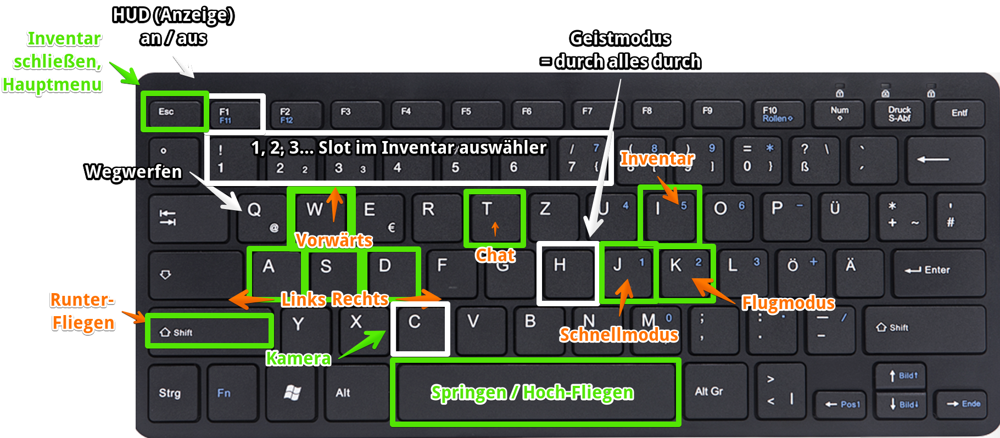
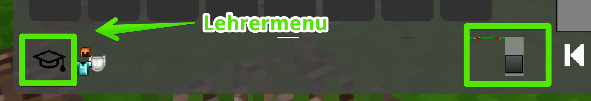
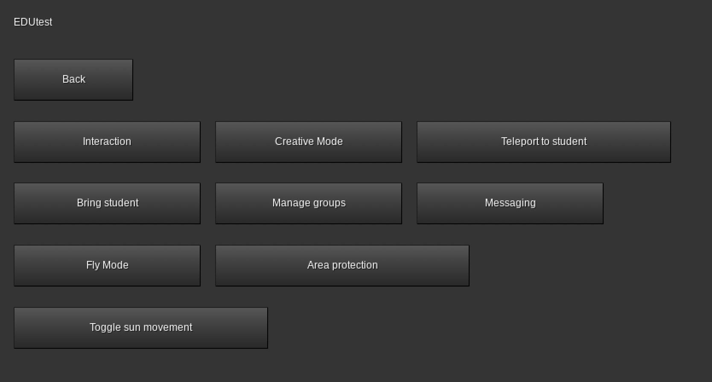

# Spickzettel für Minetest

## Allgemeine Bedienung

### Steuerung

### Tastatur & Maus 

| Tasten      | Funktion                                                  |                                          |
| ----------- | --------------------------------------------------------- | ---------------------------------------- |
| W A S D     | Vorwärts, Links, Rückwärts, Rechts                        |                                          |
| I           | Inventar                                                  |                                          |
| K           | Fliegen an / aus: Space hoch, Shift runter                | Benötigt Privileg `fly`                  |
| Space       | Springen                                                  |                                          |
| J           | Schnell-Modus                                             | Benötigt Privileg `fast`                 |
| C           | Kamera wechseln                                           |                                          |
| T           | Chat                                                      | Benötigt Privileg ``                     |
| ESC         | Inventar schließen, Hauptmenu, aktuellen Dialog verlassen |                                          |
| 1 2 3 4 ... | Wechselt zum Inventar-Platz                               |                                          |
| F1          | HUD An / Aus (alle Anzeigen auf dem Bildschirm)           | "Mein Inventar ist weg..." - "Drücke F1" |

# Top 12 Commandos

| Befehl                | Ergebnis                                                     |                                                       |
| --------------------- | ------------------------------------------------------------ | ----------------------------------------------------- |
| /teleport 0 1 2       | Teleportiere Dich zu Position: 0 (Westen) 1 (Höhe) 2(Norden) |                                                       |
| /teleport ~10 0 0     | Teleportiere Dich 100 Blöcke nach Westen                     |                                                       |
| /teleport Name        | Teleportiere Dich zu "Name"                                  |                                                       |
| /teleport Name Monter | Teleportieren "Name" zu Dir (Mentor)                         |                                                       |
| TAB                   | TAB-Taste (unter ESC) zum vervollständigen von Namen etc.    |                                                       |
| /grant Name fly       | Erlaube Name das fly Privileg = er darf fliegen              | Achtung - es gibt kein @a, um allen Rechte zuzuweisen |
| /grantme all          | Erlabe mir alles                                             |                                                       |
|                       |                                                              |                                                       |
|                       |                                                              |                                                       |
|                       |                                                              |                                                       |
|                       |                                                              |                                                       |
|                       |                                                              |                                                       |

# Edutest

Eine sehr hilfreiche Mod für den Einsatz mit Schülern ist EduTest. Damit kann man viele Befehle für Lehrer sehr komfortabel direkt per Klick auswählen.

# WorldEdit

Mit WorldEdit lassen sich große Änderungen in der Minetest Welt mit wenigen Schritten erledigen.

## 1. Bereich markieren

